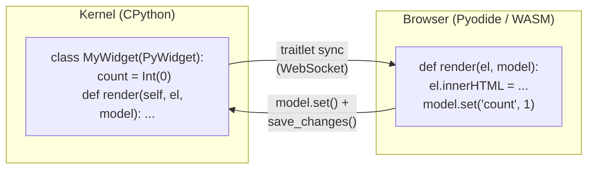

# pywidget

Write Jupyter widgets **entirely** in Python — no JavaScript required.

pywidget lets you define both the kernel-side state *and* the browser-side
rendering of a Jupyter widget in a single Python class. Your rendering code
runs in the browser via [Pyodide](https://pyodide.org/) (CPython compiled to
WebAssembly) and syncs state bidirectionally with the kernel through
[anywidget](https://anywidget.dev/).

Runs anywhere [anywidget](https://anywidget.dev/) runs — Jupyter Lab, Jupyter Notebook, [marimo](https://marimo.io/), and more.

### Why pywidget?

- **One language** — define state, rendering, and interaction logic all in Python.
  No JavaScript, no separate frontend build step.
- **Responsive UI** — event handlers run locally in the browser via Pyodide.
  No round-trip to the kernel on every click or keystroke.
- **Full Python in the browser** — import NumPy, Pandas, scikit-learn, and
  [250+ other packages](https://pyodide.org/en/stable/usage/packages-in-pyodide.html)
  directly in your rendering code via Pyodide's scientific stack.
- **Real methods, not strings** — write `render` and `update` as regular methods
  on your class with full IDE support (autocomplete, linting, go-to-definition).
- **Zero build infrastructure** — `pip install pywidget` and go. No `npm`,
  no webpack, no `jupyter labextension develop`.



## Install

```bash
pip install pywidget
```

For use with marimo:

```bash
pip install pywidget marimo
```

## Quick example

```python
import traitlets
from pywidget import PyWidget

class CounterWidget(PyWidget):
    count = traitlets.Int(0).tag(sync=True)

    def render(self, el, model):
        count = model.get("count")
        el.innerHTML = f"""
        <div style="display:flex; align-items:center; gap:12px; font-family:sans-serif;">
            <button id="dec">-</button>
            <span id="display">{count}</span>
            <button id="inc">+</button>
        </div>
        """
        def on_inc(event):
            new = model.get("count") + 1
            model.set("count", new)
            model.save_changes()
            el.querySelector("#display").textContent = str(new)

        def on_dec(event):
            new = model.get("count") - 1
            model.set("count", new)
            model.save_changes()
            el.querySelector("#display").textContent = str(new)

        el.querySelector("#inc").addEventListener("click", create_proxy(on_inc))
        el.querySelector("#dec").addEventListener("click", create_proxy(on_dec))

    def update(self, el, model):
        display = el.querySelector("#display")
        if display:
            display.textContent = str(model.get("count"))

CounterWidget()
```

## Usage with marimo

In [marimo](https://marimo.io/), wrap your widget instance with
`mo.ui.anywidget()` to integrate with marimo's reactive execution engine:

```python
import marimo as mo
import traitlets
from pywidget import PyWidget

class CounterWidget(PyWidget):
    count = traitlets.Int(0).tag(sync=True)

    def render(self, el, model):
        count = model.get("count")
        el.innerHTML = f"""
        <div style="display:flex; align-items:center; gap:12px; font-family:sans-serif;">
            <button id="dec">-</button>
            <span id="display">{count}</span>
            <button id="inc">+</button>
        </div>
        """
        def on_inc(event):
            new = model.get("count") + 1
            model.set("count", new)
            model.save_changes()
            el.querySelector("#display").textContent = str(new)

        def on_dec(event):
            new = model.get("count") - 1
            model.set("count", new)
            model.save_changes()
            el.querySelector("#display").textContent = str(new)

        el.querySelector("#inc").addEventListener("click", create_proxy(on_inc))
        el.querySelector("#dec").addEventListener("click", create_proxy(on_dec))

widget = mo.ui.anywidget(CounterWidget())
widget
```

Changes to synced traitlets propagate through marimo's dependency graph, so
downstream cells re-execute automatically. See `examples/pywidget_marimo_demo.py`
for a full walkthrough.

The `render` and `update` methods look like regular Python, but they execute
**in the browser** inside a Pyodide runtime. At class-creation time pywidget
extracts their source via `inspect.getsource()`, strips `self`, and sends the
code to the frontend. The kernel never runs these methods.

## The `model` API

Inside `render` and `update`, the `model` object supports:

| Method | Description |
|--------|-------------|
| `model.get(name)` | Read a synced traitlet (returns Python-native types) |
| `model.set(name, value)` | Write a synced traitlet (local until `save_changes`) |
| `model.save_changes()` | Push pending `set()` calls to the kernel |
| `model.on(event, callback)` | Subscribe to events (e.g. `"change:count"`) |

## Browser-side builtins

The rendering namespace automatically includes:

- `create_proxy(fn)` — prevent GC of Python callbacks passed to JS APIs like `addEventListener`
- `to_js(obj)` — explicitly convert a Python object to a JS value
- `document` — the browser's `document` object
- `console` — the browser's `console` object

## Installing packages in the browser

Use `_py_packages` to install packages via `micropip` before rendering:

```python
class StatsWidget(PyWidget):
    data = traitlets.List(traitlets.Float(), []).tag(sync=True)
    _py_packages = ["numpy"]

    def render(self, el, model):
        import numpy as np
        arr = np.array(list(model.get("data")))
        el.innerHTML = f"Mean: {arr.mean():.2f}, Std: {arr.std():.2f}"
```

Any pure-Python wheel or package bundled with Pyodide works here (`numpy`,
`pandas`, `scipy`, and ~200 others).

## String-based alternative

If you prefer, you can set `_py_render` directly instead of defining methods:

```python
class HelloWidget(PyWidget):
    _py_render = """
def render(el, model):
    el.innerHTML = "<h2>Hello from Pyodide!</h2>"
"""
```

When `_py_render` is set explicitly, method extraction is skipped.

## Performance

- **First render: 3–5 s** — Pyodide (~11 MB WASM) downloads once per page.
  Subsequent page loads use the browser cache (1–2 s).
- **Subsequent widgets: instant** — all instances share a single Pyodide runtime.
- **Interaction latency: near-zero** — event handlers run locally in the browser;
  kernel sync happens asynchronously.

## How pywidget relates to the ecosystem

|  | ipywidgets | anywidget | pywidget |
|--|------------|-----------|----------|
| Custom rendering | No (fixed set of widgets) | Yes, in JavaScript | Yes, in Python |
| Interaction latency | Kernel round-trip | Local in browser | Local in browser |
| Browser runtime | None | None | Pyodide (~11 MB, cached) |
| Jupyter support | Yes | Yes | Yes |
| marimo support | No | Yes | Yes |

pywidget is a thin layer on top of anywidget. `PyWidget` subclasses
`anywidget.AnyWidget` and sets `_esm` to a JS bridge (~170 lines) that loads
Pyodide, runs your Python rendering code in an isolated namespace, and proxies
the anywidget model API. No modifications to anywidget are needed.

## License

MIT
